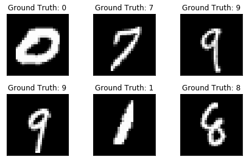
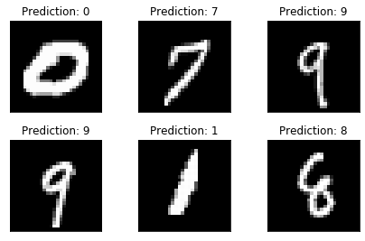

# MNSIT HANDWRITTEN DIGIT RECOGNETION USING CNN IN PYTORCH
a simple convolutional neural network in PyTorch and train it to recognize handwritten digits using the MNIST dataset. Training a classifier on the MNIST dataset can be regarded as the hello world of image recognition.
## Sample Data

##  Network used

 class Net(nn.Module):
     """ConvNet -> Max_Pool -> RELU -> ConvNet -> Max_Pool -> RELU -> FC -> RELU -> FC -> SOFTMAX"""
     def __init__(self):
         super(Net, self).__init__()
         self.conv1 = nn.Conv2d(1, 20, 5, 1)
         self.conv2 = nn.Conv2d(20, 50, 5, 1)
         self.fc1 = nn.Linear(4*4*50, 500)
         self.fc2 = nn.Linear(500, 10)

    def forward(self, x):
        x = F.relu(self.conv1(x))
        x = F.max_pool2d(x, 2, 2)
        x = F.relu(self.conv2(x))
        x = F.max_pool2d(x, 2, 2)
        x = x.view(-1, 4*4*50)
        x = F.relu(self.fc1(x))
        x = self.fc2(x)
        return F.log_softmax(x, dim=1)
## Sample Predition

